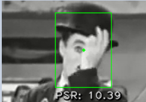
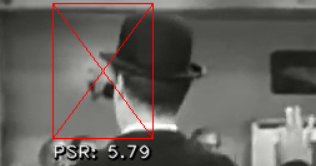
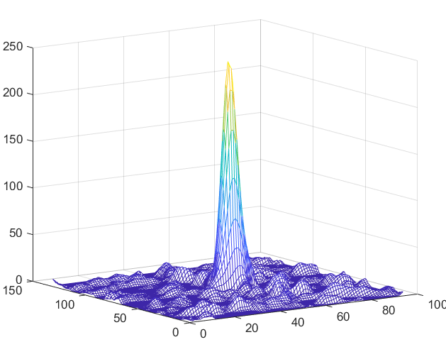
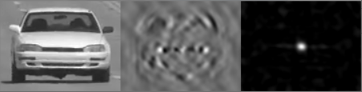

# Visual Object Tracking using Adaptive Correlation Filters (MOSSE)

## Overview

This repository implements a **real-time visual object tracking system** based on **Adaptive Correlation Filters (MOSSE)**.

The method is inspired by Bolme et al. (2010) and uses frequency-domain signal processing to achieve fast and robust tracking.

The system supports:
- Real-time video tracking
- Interactive GUI (Tkinter)
- Multi-object tracking
- PSR-based tracking reliability
- Classical baseline comparisons (template matching / cross-correlation)

---

## User Interface

The system provides an interactive GUI for easy usage.

Users can:
- Select video or webcam input
- Define ROI (Region of Interest)
- Track objects in real-time
- Monitor tracking confidence (PSR)
- Pause / resume / reset tracking


---

## Method Overview

The tracker is based on the MOSSE adaptive correlation filter:

- Training via synthetic perturbations
- Gaussian desired response
- FFT-based correlation
- Online adaptation with learning rate
- PSR used for confidence estimation

---

## Project Structure
```
efficient-object-tracking-MOSSE/
├── common/
│   └── utils.py
│
├── core/
│   ├── controller.py
│   ├── mosse.py
│   ├── template_matching.py
│   └── matlab/
│       ├── cross_correlation.m
│       └── mesh_correlation_results.m
│
├── data/
│   ├── videos/
│   ├── matlab/
│   └── template_matching_data/
│
├── assets/
│   ├── ui_demo.pn
│   └── results/
│       ├── high_psr.png
│       ├── low_psr.png
│       ├── correlation_surface.png
│       ├── kernel_response.png
│       └── tracking_example.png
├── report/
│   └── report.pdf
│
├── ui.py
└── README.md

```

---

## Results

### High PSR Tracking (Success Case)

Robust tracking under occlusion and rotation.



---

### Low PSR Failure Case

Tracking fails when correlation response becomes ambiguous.




---

### Correlation Response Surface

Frequency-domain correlation visualization.




---

### Kernel (Learned Filter)

Visualization of learned MOSSE filter.




---

### Tracking Output

Real-time bounding box tracking with PSR display.


---

## Evaluation

Comparison with classical methods:

- Cross-correlation (MATLAB)
- Template matching (OpenCV)

### Key Findings:
- MOSSE is robust under occlusion and rotation
- Classical template matching fails under appearance changes
- PSR effectively measures tracking confidence

---

## Controls

- Mouse Drag → Select ROI
- Space → Pause/Resume
- C → Clear trackers
- ESC → Exit

---

## Requirements

- Python 3.7+
- OpenCV
- NumPy
- Tkinter
- Matplotlib

